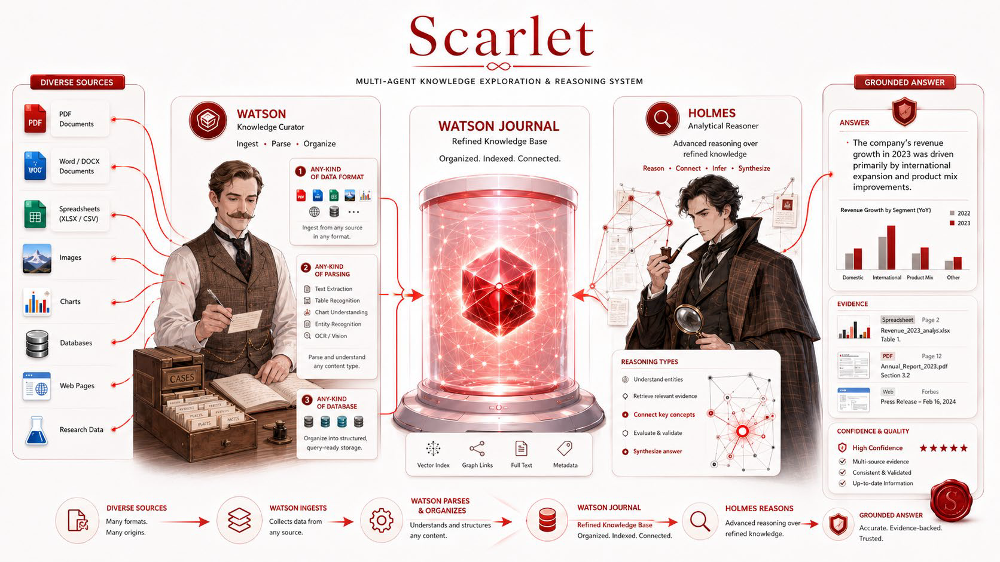
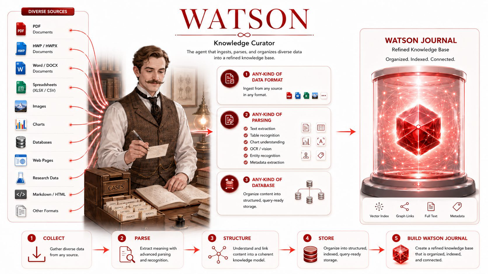
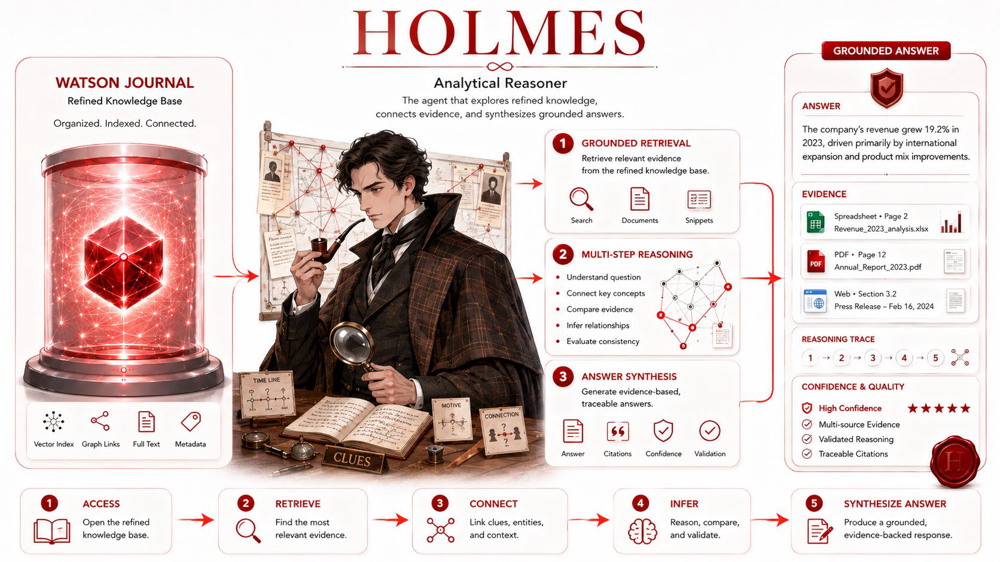
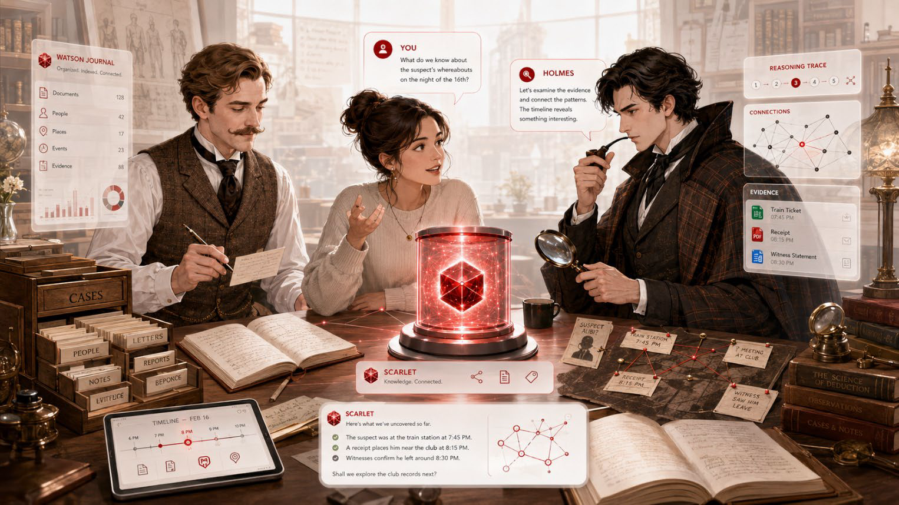
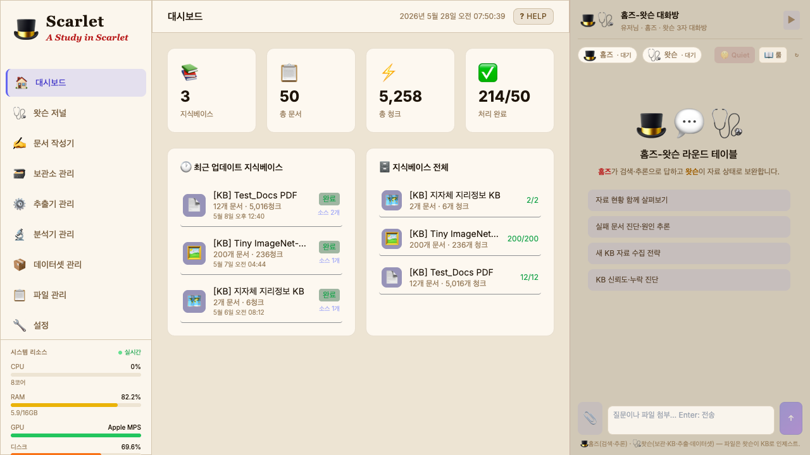

<div align="center">

# 🎩 Scarlet

### 멀티에이전트 지식 탐색 및 추론 시스템

<p>
  
  
  
</p>



</div>

---

## 🔎 개요

> *"무채색 인생의 실타래 속을 가로지르는 주홍빛 실(scarlet thread)을 풀어내는 것"* — 셜록 홈즈

**스칼렛(Scarlet)은 다양한 문서와 데이터를 스스로 탐색·정리하고, 근거 기반 추론으로 답변을 생성하는 멀티에이전트 지식 탐색 시스템입니다.**

코난 도일의 첫 셜록 홈즈 소설 [*A Study in Scarlet*](https://en.wikipedia.org/wiki/A_Study_in_Scarlet)(주홍색 연구, 1887)의 **홈즈–왓슨 콤비**를 모티프로, 두 에이전트가 역할을 나눠 협업합니다 — **왓슨이 정리하고, 홈즈가 추론합니다.**

---

## 🩺 왓슨 (Watson) — 자료 수집·지식화

<div align="center">
  
</div>

- **수집** — 다양한 문서·데이터를 수집하여 지식화 대상으로 통합
- **파싱** — 텍스트·표·이미지·차트·메타데이터 등을 파싱하고 해석
- **구조화** — 추출 정보를 의미 단위로 구조화하고 관계를 정리
- **저장** — Vector Index · Graph Links · Full Text · Metadata 형태로 저장
- **보관소 통합** — VectorDB · 관계형 DB · NoSQL · 검색엔진 · MCP · 로컬 파일 · Obsidian 등 다양한 데이터 보관소를 통합 관리
- **추출기** — PDF·DOCX·PPTX·HTML·이미지·미디어 등 파일 유형에 맞는 추출기를 자동 선택
- 최종적으로 **Watson Journal**을 구축

> **📚 Watson Journal** — 왓슨이 수집·파싱·구조화한 데이터를 VectorDB와 원본 소스에 연결해 만든 정련된 지식베이스. 문서·청크·메타데이터·처리상태를 관리하며, 홈즈가 근거 검색과 추론을 수행하는 기반 지식 저장소입니다.

---

## 🎩 홈즈 (Holmes) — 검색·추론

<div align="center">
  
</div>

- **근거 검색** — Watson Journal에서 사용자의 질문과 관련된 핵심 근거를 검색
- **단서 선별** — 문서·표·메타데이터·관계 정보에서 의미 있는 단서를 선별
- **다단계 추론** — 단서 간 개념·맥락·인과관계를 연결·비교하고, 답변의 논리와 근거를 검증
- **답변 생성** — 최종적으로 근거 기반의 신뢰 가능한 답변을 생성

홈즈는 다음을 갖춘 에이전트입니다:
- **자율사고(Self-Thought)** 가 가능
- **기억** — 연속적 사고의 히스토리, 기억 그래프
- **자발적 도구 사용**

---

## 💬 홈즈와 왓슨, 그리고 사용자의 대화

<div align="center">
  
</div>

사용자·홈즈·왓슨이 한 자리에서 대화합니다. 사용자가 질문하면 **왓슨이 관련 자료를 짚어주고, 홈즈가 근거를 연결해 추론**하며, Scarlet이 추론 경로(reasoning trace)와 근거(evidence)를 함께 제시해 신뢰 가능한 답변을 만들어냅니다.

```
데이터  →  🩺 왓슨 (수집·파싱·구조화)  →  📚 Watson Journal  →  🎩 홈즈 (검색·다단계 추론)  →  근거 기반 답변
```

---

## 🖥️ 화면

<div align="center">
  
</div>

---

## 📞 문의
- 이용 (ryonglee@kisti.re.kr)

---

## 👥 팀 BLUESKY
- 이용 (ryonglee@kisti.re.kr)
- 장래영 (raezero@kisti.re.kr)
- 구자현 (jahyeongu@kisti.re.kr)
